# 🌐 ApiGateway Service - Complete Learning Guide

A comprehensive guide to understanding the **ApiGateway** service implementation, showcasing Ocelot API Gateway, microservice routing, caching, rate limiting, and security patterns.

## 📋 Table of Contents

- [🎯 Service Overview](#-service-overview)
- [🏗️ Architecture & Design Patterns](#️-architecture--design-patterns)
- [📁 Project Structure](#-project-structure)
- [🔄 Data Flow & Component Interactions](#-data-flow--component-interactions)
- [🔧 Implementation Details](#-implementation-details)
- [🚀 Step-by-Step Implementation Guide](#-step-by-step-implementation-guide)
- [📊 Configuration & Routing](#-database--migrations)
- [🧪 Testing & Validation](#-testing--validation)
- [🔍 Code Analysis & Best Practices](#-code-analysis--best-practices)
- [🚨 Common Issues & Solutions](#-common-issues--solutions)
- [📈 Future Improvements](#-future-improvements)
- [🔗 Related Resources](#-related-resources)

## 🎯 Service Overview

The **ApiGateway** service is the central entry point for all client requests in our e-commerce microservices platform. It demonstrates:

- **Ocelot API Gateway** for microservice routing and orchestration
- **JWT Authentication** integration for secure API access
- **Rate Limiting** to prevent API abuse and ensure service stability
- **Response Caching** for improved performance and reduced backend load
- **CORS Configuration** for cross-origin request handling
- **Custom Middleware** for request signature and security
- **OpenAPI Integration** for API documentation and testing

### 🎯 Business Capabilities

| Feature | Description | HTTP Method | Endpoint |
|---------|-------------|-------------|----------|
| **Authentication Routing** | Route auth requests to AuthenticationAPI | `GET`, `POST` | `/api/authentication/*` |
| **Product Catalog Routing** | Route product requests to ProductApi | `GET`, `POST`, `PUT`, `DELETE` | `/api/products/*` |
| **Order Management Routing** | Route order requests to OrderApi | `GET`, `POST`, `PUT`, `DELETE` | `/api/orders/*` |
| **Rate Limiting** | Prevent API abuse with request throttling | All | All endpoints |
| **Response Caching** | Cache responses for improved performance | `GET` | Product and Order endpoints |
| **JWT Authentication** | Secure protected endpoints with token validation | All | Protected endpoints |

## 🏗️ Architecture & Design Patterns

### API Gateway Architecture

```
🌐 Client Applications
         ↓
    🔐 ApiGateway (Ocelot)
         ↓
    ┌─────────┬─────────┬─────────┐
    ↓         ↓         ↓         ↓
🔐 AuthAPI  🛍️ ProductAPI  🛒 OrderAPI  📚 SharedLibrary
```

#### Gateway Responsibilities

| Responsibility | Purpose | Implementation | Benefits |
|----------------|---------|----------------|----------|
| **Routing** | Direct requests to appropriate microservices | Ocelot routing configuration | Single entry point, load balancing |
| **Authentication** | Validate JWT tokens for protected endpoints | JWT Bearer authentication | Centralized security, token validation |
| **Rate Limiting** | Prevent API abuse and ensure stability | Ocelot rate limiting | Service protection, fair usage |
| **Caching** | Improve response times and reduce backend load | Ocelot caching with cache manager | Performance optimization, reduced latency |
| **CORS** | Handle cross-origin requests | CORS middleware configuration | Frontend integration, browser compatibility |

### Design Patterns Implemented

| Pattern | Purpose | Implementation | Benefits |
|---------|---------|----------------|----------|
| **API Gateway Pattern** | Single entry point for all services | Ocelot gateway implementation | Centralized control, simplified client integration |
| **Middleware Pattern** | Request/response processing pipeline | Custom middleware for request signing | Request modification, security enhancement |
| **Configuration Pattern** | External configuration management | Ocelot configuration in JSON | Runtime configuration, environment-specific settings |
| **Caching Pattern** | Response caching for performance | Ocelot cache manager integration | Reduced latency, improved user experience |

## 📁 Project Structure

```
src/ApiGateway/
├── 📁 ApiGateway.Presentation/
│   ├── 📁 Middleware/
│   │   └── 📄 AttachSignatureToRequest.cs    # Custom request signing middleware
│   ├── 📄 Program.cs                          # Application entry point and configuration
│   ├── 📄 ocelot.json                         # Ocelot routing and configuration
│   ├── 📄 appsettings.json                    # Application configuration
│   ├── 📄 appsettings.Development.json        # Development-specific configuration
│   └── 📄 ApiGateway.Presentation.csproj     # Project file
```

## 🔄 Data Flow & Component Interactions

### 0. Complete ApiGateway Request Flow

```mermaid
sequenceDiagram
    participant Client as HTTP Client
    participant Gateway as ApiGateway
    participant Middleware as Custom Middleware
    participant Ocelot as Ocelot Router
    participant Auth as AuthenticationAPI
    participant Product as ProductAPI
    participant Order as OrderAPI

    Note over Client,Order: 🚀 REQUEST PROCESSING
    Client->>Gateway: HTTP Request to any endpoint
    Gateway->>Middleware: Process request through custom middleware
    Middleware->>Middleware: Attach "Api-Gateway" header
    Middleware->>Ocelot: Forward to Ocelot routing
    
    Note over Client,Order: 🔐 AUTHENTICATION CHECK
    alt Protected Endpoint
        Ocelot->>Ocelot: Validate JWT token
        alt Invalid Token
            Ocelot->>Client: 401 Unauthorized
        else Valid Token
            Ocelot->>Ocelot: Continue routing
        end
    end
    
    Note over Client,Order: 📍 ROUTING & RATE LIMITING
    Ocelot->>Ocelot: Check rate limiting rules
    alt Rate Limit Exceeded
        Ocelot->>Client: 429 Too Many Requests
    else Within Rate Limit
        Ocelot->>Ocelot: Route to appropriate microservice
        
        alt Authentication Request
            Ocelot->>Auth: Forward to AuthenticationAPI
            Auth->>Ocelot: Return response
        else Product Request
            Ocelot->>Product: Forward to ProductAPI
            Product->>Ocelot: Return response
        else Order Request
            Ocelot->>Order: Forward to OrderAPI
            Order->>Ocelot: Return response
        end
        
        Ocelot->>Gateway: Return microservice response
        Gateway->>Client: Return final response
    end
```



### 1. Service Startup Flow


### 2. Request Routing Flow


### 3. Authentication Flow


### 4. Protected Endpoint Flow


## 🔧 Implementation Details

### 1. Ocelot Configuration (`ocelot.json`)

#### Authentication Routes
```json
{
    "DownstreamPathTemplate": "/api/authentication/{everything}",
    "DownstreamScheme": "http",
    "DownstreamHostAndPorts": [{"Host": "localhost", "Port": 5000}],
    "UpstreamPathTemplate": "/api/authentication/{everything}",
    "UpstreamHttpMethod": ["GET", "POST"],
    "RateLimitOptions": {
        "EnableRateLimiting": true,
        "Period": "60s",
        "Limit": 1
    }
}
```

**Key Features:**
- **Rate Limiting**: 1 request per 60 seconds for authentication endpoints
- **Flexible Routing**: `{everything}` placeholder for all auth paths
- **HTTP Scheme**: Direct communication with AuthenticationAPI

#### Product Routes
```json
{
    "DownstreamPathTemplate": "/api/products",
    "DownstreamHostAndPorts": [{"Host": "localhost", "Port": 5001}],
    "FileCacheOptions": {
        "TtlSeconds": 60,
        "Region": "default",
        "Header": "eCommerce-Caching-Control"
    }
}
```

**Key Features:**
- **Response Caching**: 60-second TTL for improved performance
- **Cache Headers**: Custom caching control headers
- **Read Operations**: Optimized for GET requests

#### Protected Product Routes
```json
{
    "DownstreamPathTemplate": "/api/products/{everything}",
    "UpstreamHttpMethod": ["POST", "PUT", "DELETE"],
    "AuthenticationOptions": {
        "AuthenticationProviderKey": "Bearer",
        "AllowedScopes": []
    }
}
```

**Key Features:**
- **JWT Authentication**: Bearer token required for modifications
- **Scope Control**: Configurable scope restrictions
- **CRUD Operations**: Full create, update, delete support

#### Order Routes
```json
{
    "DownstreamPathTemplate": "/api/orders",
    "DownstreamHostAndPorts": [{"Host": "localhost", "Port": 5002}],
    "AuthenticationOptions": {
        "AuthenticationProviderKey": "Bearer"
    }
}
```

**Key Features:**
- **JWT Protection**: All order operations require authentication
- **Port Routing**: Directs to OrderApi on port 5002
- **Full CRUD**: Supports all HTTP methods with proper auth

### 2. Custom Middleware (`AttachSignatureToRequest.cs`)

```csharp
public class AttachSignatureToRequest(RequestDelegate next)
{
    public async Task InvokeAsync(HttpContext context)
    {
        context.Request.Headers["Api-Gateway"] = "Signed";
        await next(context);
    }
}
```

**Purpose:**
- **Security Enhancement**: Adds signature header to all requests
- **Microservice Protection**: Enables ListenToOnlyApiGateway middleware
- **Request Identification**: Marks requests as coming from authorized gateway

### 3. Program Configuration (`Program.cs`)

#### Service Registration
```csharp
// Load Ocelot configuration
builder.Configuration.AddJsonFile("ocelot.json", optional: false, reloadOnChange: true);

// Add OpenAPI and Ocelot services
builder.Services.AddOpenApi();
builder.Services.AddOcelot().AddCacheManager(x => x.WithDictionaryHandle());

// Add JWT authentication
JWTAuthenticationScheme.AddJwtAuthenticationScheme(builder.Services, builder.Configuration);

// Configure CORS
builder.Services.AddCors(options =>
{
    options.AddDefaultPolicy(policy =>
    {
        policy.AllowAnyHeader()
              .AllowAnyMethod()
              .AllowAnyOrigin();
    });
});
```

#### Middleware Pipeline
```csharp
// Configure HTTP pipeline
app.UseHttpsRedirection();
app.UseCors();
app.MapOpenApi();

// Custom middleware before Ocelot
app.UseMiddleware<AttachSignatureToRequest>();

// Ocelot should be last
await app.UseOcelot();
```

## 🚀 Step-by-Step Implementation Guide

### Step 1: Project Setup

1. **Create ApiGateway Project**
   ```bash
   dotnet new web -n ApiGateway.Presentation
   cd ApiGateway.Presentation
   ```

2. **Install Required Packages**
   ```bash
   dotnet add package Ocelot
   dotnet add package Ocelot.Cache.CacheManager
   dotnet add package Microsoft.AspNetCore.OpenApi
   ```

3. **Add SharedLibrary Reference**
   ```bash
   dotnet add reference ../../SharedLibrary/SharedLibrary.csproj
   ```

### Step 2: Ocelot Configuration

1. **Create ocelot.json**
   - Define routes for each microservice
   - Configure rate limiting and caching
   - Set up authentication requirements

2. **Configure Service Discovery**
   - Define downstream host and ports
   - Set upstream path templates
   - Configure HTTP methods

### Step 3: Custom Middleware

1. **Implement AttachSignatureToRequest**
   - Add security header to all requests
   - Ensure proper middleware order
   - Test header attachment

### Step 4: Service Integration

1. **Configure JWT Authentication**
   - Integrate with SharedLibrary JWT scheme
   - Set up authentication provider keys
   - Test token validation

2. **Set Up Caching**
   - Configure cache manager
   - Define cache regions and TTL
   - Test caching behavior

### Step 5: Testing & Validation

1. **Test Routing**
   - Verify requests reach correct microservices
   - Test rate limiting functionality
   - Validate authentication requirements

2. **Test Caching**
   - Verify response caching works
   - Test cache invalidation
   - Monitor performance improvements

## 📊 Configuration & Routing

### Global Configuration

```json
{
    "GlobalConfiguration": {
        "BaseUrl": "https://localhost:5003",
        "RateLimitOptions": {
            "QuotaExceededMessage": "You are overwhelming me with multiple requests"
        }
    }
}
```

**Features:**
- **Base URL**: Centralized gateway endpoint
- **Rate Limiting**: Global rate limit configuration
- **Custom Messages**: User-friendly error messages

### Route Configuration Patterns

#### Pattern 1: Simple Routing
```json
{
    "DownstreamPathTemplate": "/api/products",
    "UpstreamPathTemplate": "/api/products"
}
```

#### Pattern 2: Parameterized Routing
```json
{
    "DownstreamPathTemplate": "/api/products/{id}",
    "UpstreamPathTemplate": "/api/products/{id}"
}
```

#### Pattern 3: Wildcard Routing
```json
{
    "DownstreamPathTemplate": "/api/products/{everything}",
    "UpstreamPathTemplate": "/api/products/{everything}"
}
```

### Rate Limiting Configuration

#### Authentication Endpoints
- **Period**: 60 seconds
- **Limit**: 1 request per period
- **Purpose**: Prevent brute force attacks

#### Product Endpoints
- **Read Operations**: No rate limiting (cached responses)
- **Write Operations**: JWT authentication required
- **Purpose**: Balance security and performance

#### Order Endpoints
- **All Operations**: JWT authentication required
- **Purpose**: Ensure secure order management

### Caching Configuration

#### Cache Regions
- **Default Region**: General caching for all services
- **TTL**: 60 seconds for optimal performance
- **Headers**: Custom caching control headers

#### Cache Headers
```http
eCommerce-Caching-Control: cache-control-header
```

## 🧪 Testing & Validation

### 1. Gateway Functionality Testing

#### Route Testing
```bash
# Test authentication routing
curl -X POST https://localhost:5003/api/authentication/login

# Test product routing
curl -X GET https://localhost:5003/api/products

# Test order routing
curl -X GET https://localhost:5003/api/orders
```

#### Authentication Testing
```bash
# Test protected endpoint without token
curl -X POST https://localhost:5003/api/products

# Test protected endpoint with valid token
curl -X POST https://localhost:5003/api/products \
  -H "Authorization: Bearer <jwt-token>"
```

### 2. Rate Limiting Testing

#### Authentication Rate Limiting
```bash
# First request (should succeed)
curl -X POST https://localhost:5003/api/authentication/login

# Second request within 60s (should fail with 429)
curl -X POST https://localhost:5003/api/authentication/login
```

#### Expected Response
```json
{
    "message": "You are overwhelming me with multiple requests"
}
```

### 3. Caching Testing

#### Cache Headers Verification
```bash
curl -I https://localhost:5003/api/products
```

#### Expected Headers
```http
HTTP/1.1 200 OK
eCommerce-Caching-Control: cache-control-header
Cache-Control: public, max-age=60
```

### 4. Security Testing

#### Gateway Signature Header
```bash
curl -v https://localhost:5003/api/products
```

#### Expected Headers
```http
Api-Gateway: Signed
```

## 🔍 Code Analysis & Best Practices

### 1. Security Best Practices

#### JWT Token Validation
- **Validate Lifetime**: Ensure tokens haven't expired
- **Scope Validation**: Check user permissions
- **Token Refresh**: Implement token refresh mechanisms

#### Rate Limiting Strategy
- **Per-Endpoint Limits**: Different limits for different services
- **User-Based Limits**: Consider user-specific rate limiting
- **IP-Based Limits**: Prevent abuse from specific sources

### 2. Performance Best Practices

#### Caching Strategy
- **Cache Invalidation**: Implement proper cache invalidation
- **Cache Regions**: Use different cache regions for different data types
- **TTL Optimization**: Balance cache freshness with performance

#### Load Balancing
- **Health Checks**: Monitor microservice health
- **Circuit Breaker**: Implement circuit breaker patterns
- **Retry Policies**: Add retry logic for failed requests

### 3. Monitoring Best Practices

#### Logging
- **Request Logging**: Log all incoming requests
- **Response Logging**: Log response times and status codes
- **Error Logging**: Detailed error logging for debugging

#### Metrics
- **Response Times**: Monitor gateway response times
- **Error Rates**: Track error rates by endpoint
- **Throughput**: Monitor requests per second

## 🚨 Common Issues & Solutions

### 1. Routing Issues

#### Problem: Requests not reaching microservices
**Symptoms:**
- 404 errors for valid endpoints
- Timeout errors
- Incorrect routing

**Solutions:**
1. **Verify ocelot.json Configuration**
   ```json
   {
       "DownstreamPathTemplate": "/api/products",
       "DownstreamHostAndPorts": [{"Host": "localhost", "Port": 5001}]
   }
   ```

2. **Check Microservice Availability**
   ```bash
   curl http://localhost:5001/api/products
   ```

3. **Verify Port Configuration**
   - Ensure microservices are running on correct ports
   - Check firewall and network configuration

#### Problem: Authentication not working
**Symptoms:**
- 401 errors for valid tokens
- JWT validation failures
- Authentication provider key issues

**Solutions:**
1. **Verify JWT Configuration**
   ```csharp
   JWTAuthenticationScheme.AddJwtAuthenticationScheme(builder.Services, builder.Configuration);
   ```

2. **Check Authentication Provider Key**
   ```json
   {
       "AuthenticationOptions": {
           "AuthenticationProviderKey": "Bearer"
       }
   }
   ```

3. **Validate JWT Token**
   - Check token expiration
   - Verify signing key
   - Validate issuer and audience

### 2. Performance Issues

#### Problem: Slow response times
**Symptoms:**
- High latency
- Timeout errors
- Poor user experience

**Solutions:**
1. **Enable Response Caching**
   ```json
   {
       "FileCacheOptions": {
           "TtlSeconds": 60,
           "Region": "default"
       }
   }
   ```

2. **Optimize Rate Limiting**
   ```json
   {
       "RateLimitOptions": {
           "Period": "60s",
           "Limit": 100
       }
   }
   ```

3. **Monitor Resource Usage**
   - Check CPU and memory usage
   - Monitor network latency
   - Analyze response time patterns

#### Problem: Cache not working
**Symptoms:**
- No performance improvement
- Cache headers missing
- Inconsistent responses

**Solutions:**
1. **Verify Cache Configuration**
   ```csharp
   builder.Services.AddOcelot().AddCacheManager(x => x.WithDictionaryHandle());
   ```

2. **Check Cache Headers**
   ```http
   eCommerce-Caching-Control: cache-control-header
   ```

3. **Test Cache Behavior**
   - Make multiple requests to same endpoint
   - Verify response times improve
   - Check cache headers in responses

### 3. Security Issues

#### Problem: CORS errors
**Symptoms:**
- Browser CORS errors
- Preflight request failures
- Cross-origin request blocked

**Solutions:**
1. **Configure CORS Policy**
   ```csharp
   builder.Services.AddCors(options =>
   {
       options.AddDefaultPolicy(policy =>
       {
           policy.AllowAnyHeader()
                 .AllowAnyMethod()
                 .AllowAnyOrigin();
       });
   });
   ```

2. **Use CORS Middleware**
   ```csharp
   app.UseCors();
   ```

3. **Test CORS Configuration**
   - Test from different origins
   - Verify preflight requests
   - Check browser console for errors

## 📈 Future Improvements

### 1. Advanced Routing Features

#### Service Discovery
```csharp
// Implement service discovery
builder.Services.AddOcelot()
    .AddConsul()
    .AddCacheManager();
```

#### Load Balancing
```json
{
    "DownstreamHostAndPorts": [
        {"Host": "service1", "Port": 5001},
        {"Host": "service2", "Port": 5001}
    ],
    "LoadBalancerOptions": {
        "Type": "RoundRobin"
    }
}
```

### 2. Enhanced Security

#### API Key Authentication
```json
{
    "AuthenticationOptions": {
        "AuthenticationProviderKey": "ApiKey",
        "AllowedScopes": ["read", "write"]
    }
}
```

#### Rate Limiting by User
```json
{
    "RateLimitOptions": {
        "ClientWhitelist": [],
        "EnableRateLimiting": true,
        "Period": "60s",
        "Limit": 100,
        "ClientIdHeader": "X-Client-Id"
    }
}
```

### 3. Monitoring & Observability

#### Health Checks
```csharp
builder.Services.AddHealthChecks()
    .AddCheck("gateway", () => HealthCheckResult.Healthy());
```

#### Distributed Tracing
```csharp
builder.Services.AddOcelot()
    .AddOpenTelemetry()
    .AddCacheManager();
```

#### Metrics Collection
```csharp
builder.Services.AddMetrics()
    .AddPrometheusFormatter();
```

### 4. Performance Optimizations

#### Response Compression
```csharp
builder.Services.AddResponseCompression(options =>
{
    options.EnableForHttps = true;
    options.Providers.Add<BrotliCompressionProvider>();
    options.Providers.Add<GzipCompressionProvider>();
});
```

#### Connection Pooling
```json
{
    "HttpHandlerOptions": {
        "MaxConnectionsPerServer": 100,
        "PooledConnectionLifetime": "00:05:00"
    }
}
```

### 5. Advanced Caching

#### Redis Integration
```csharp
builder.Services.AddOcelot()
    .AddCacheManager(x => x.WithRedisConfiguration("redis"))
    .AddCacheManager(x => x.WithDictionaryHandle());
```

#### Cache Warming
```csharp
// Implement cache warming for frequently accessed data
public async Task WarmCacheAsync()
{
    var popularProducts = await GetPopularProductsAsync();
    await _cacheManager.SetAsync("popular-products", popularProducts, TimeSpan.FromHours(1));
}
```

## 🔗 Related Resources

### Official Documentation
- [Ocelot Documentation](https://ocelot.readthedocs.io/)
- [ASP.NET Core Documentation](https://docs.microsoft.com/en-us/aspnet/core/)
- [JWT Authentication](https://jwt.io/)

### Community Resources
- [Ocelot GitHub Repository](https://github.com/ThreeMammals/Ocelot)
- [ASP.NET Core Community](https://github.com/dotnet/aspnetcore)
- [Microservices Patterns](https://microservices.io/)

### Learning Resources
- [API Gateway Pattern](https://microservices.io/patterns/apigateway.html)
- [Rate Limiting Strategies](https://cloud.google.com/architecture/rate-limiting-strategies-techniques)
- [Caching Best Practices](https://docs.microsoft.com/en-us/azure/architecture/best-practices/caching)

---

**Status:** Production Ready ✅

The ApiGateway service is fully implemented and ready for production use. It provides comprehensive routing, authentication, caching, and rate limiting capabilities for the e-commerce microservices platform.

*Happy coding! If you have questions about the ApiGateway implementation, feel free to ask.* 🚀
