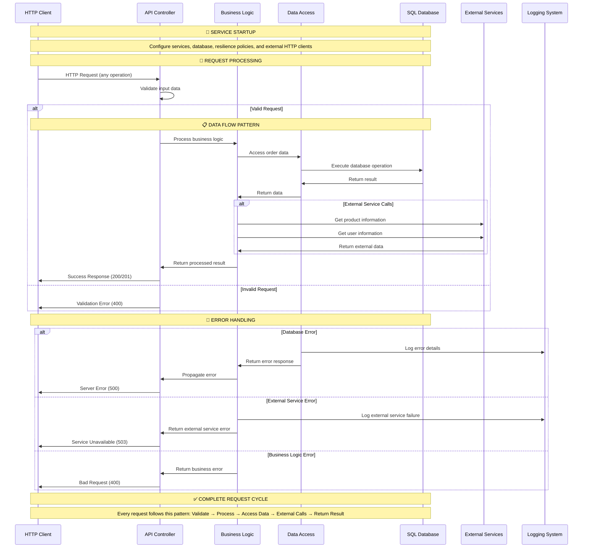
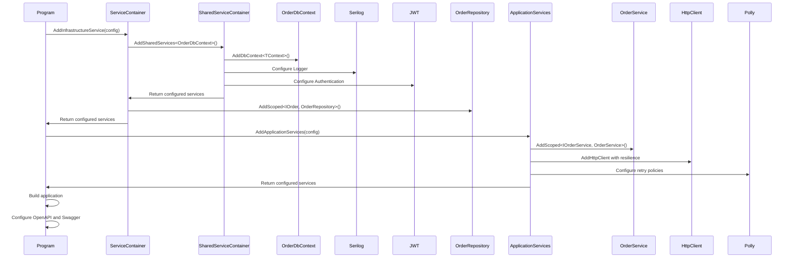
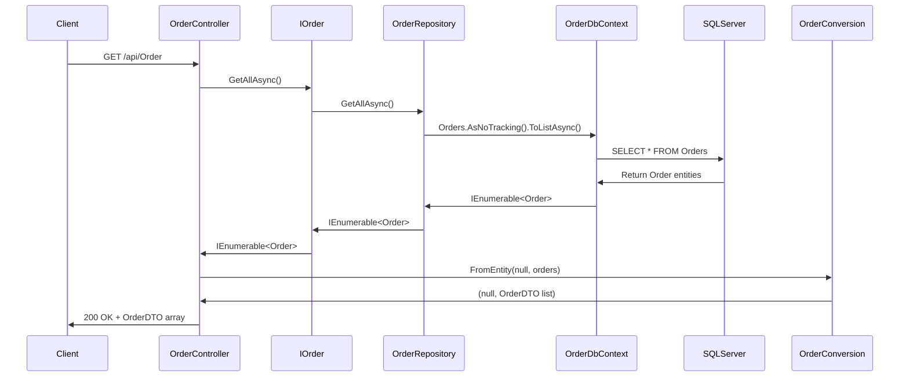
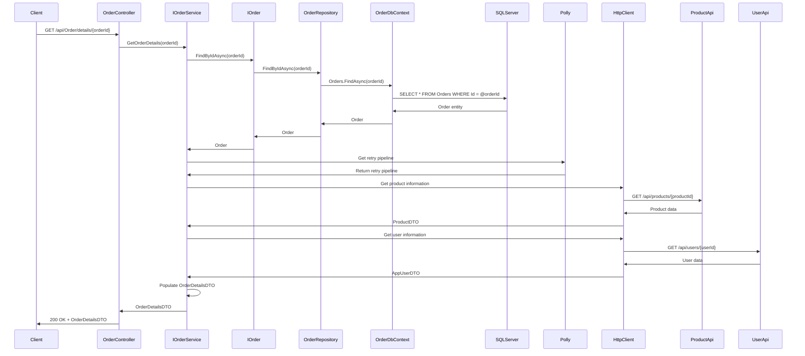
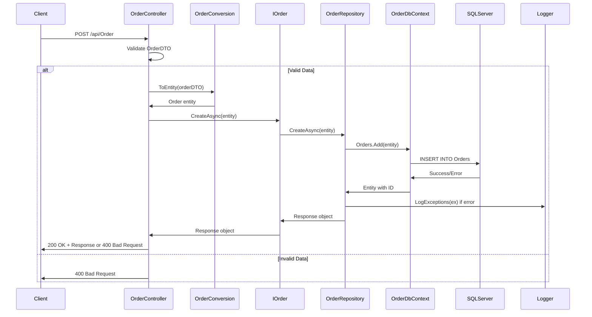
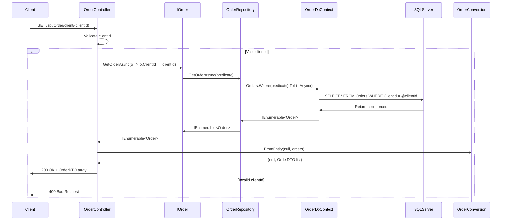
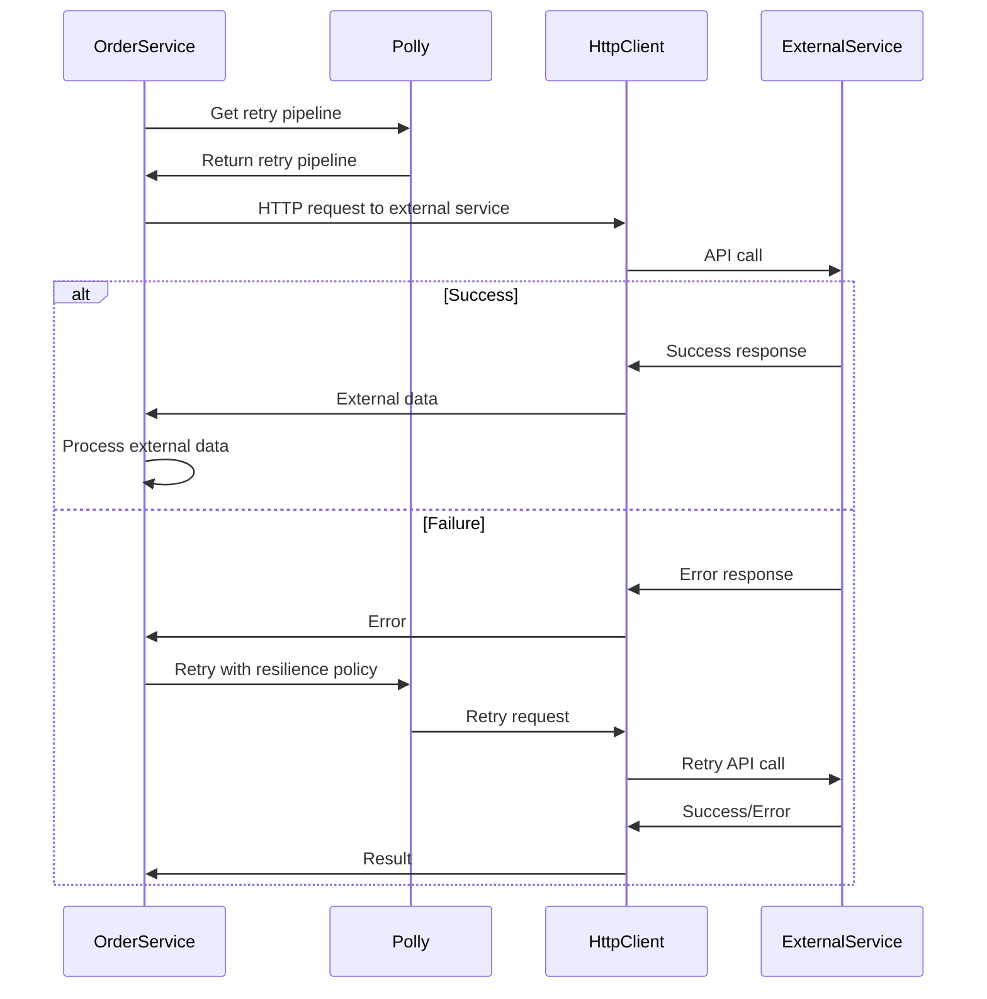
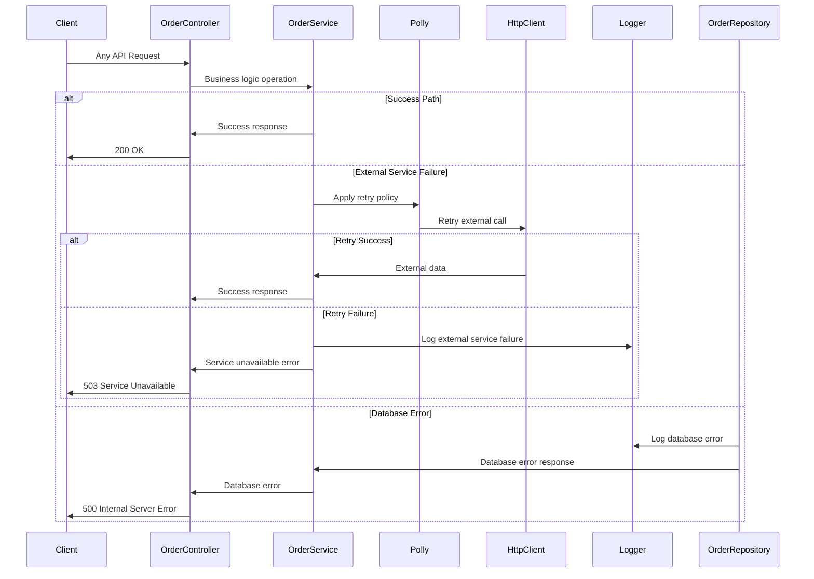

# 🛒 OrderApi Service - Complete Learning Guide

A comprehensive guide to understanding the **OrderApi** microservice implementation, showcasing Clean Architecture, Domain-Driven Design, and advanced patterns like resilience policies and external service integration.

## 📋 Table of Contents

- [🎯 Service Overview](#-service-overview)
- [🏗️ Architecture & Design Patterns](#️-architecture--design-patterns)
- [📁 Project Structure](#-project-structure)
- [🔄 Data Flow & Component Interactions](#-data-flow--component-interactions)
- [🔧 Implementation Details](#-implementation-details)
- [🚀 Step-by-Step Implementation Guide](#-step-by-step-implementation-guide)
- [📊 Database & Migrations](#-database--migrations)
- [🧪 Testing & Validation](#-testing--validation)
- [🔍 Code Analysis & Best Practices](#-code-analysis--best-practices)
- [🚨 Common Issues & Solutions](#-common-issues--solutions)
- [📈 Future Improvements](#-future-improvements)
- [🔗 Related Resources](#-related-resources)

## 🎯 Service Overview

The **OrderApi** service is a microservice responsible for managing orders in our e-commerce platform. It demonstrates advanced patterns including:

- **Clean Architecture** with 4 distinct layers
- **Domain-Driven Design** principles
- **Repository Pattern** for data access
- **DTO Pattern** for API contracts
- **Service Layer Pattern** for business logic
- **Resilience Patterns** with Polly for external service calls
- **External Service Integration** with ProductApi and UserApi
- **Advanced Data Aggregation** combining multiple data sources

### 🎯 Business Capabilities

| Feature | Description | HTTP Method | Endpoint |
|---------|-------------|-------------|----------|
| **Get All Orders** | Retrieve complete order catalog | `GET` | `/api/Order` |
| **Get Order by ID** | Retrieve specific order details | `GET` | `/api/Order/{id}` |
| **Get Client Orders** | Retrieve orders for specific client | `GET` | `/api/Order/client/{clientId}` |
| **Get Order Details** | Get comprehensive order information | `GET` | `/api/Order/details/{orderId}` |
| **Create Order** | Place new order | `POST` | `/api/Order` |
| **Update Order** | Modify existing order | `PUT` | `/api/Order` |
| **Delete Order** | Remove order | `DELETE` | `/api/Order` |

## 🏗️ Architecture & Design Patterns

### Clean Architecture Layers

```
📁 OrderApi/
├── 🎯 OrderApi.Domain/        # Core business entities & rules
├── 🔧 OrderApi.Application/   # Use cases, business logic & services
├── 🗄️ OrderApi.Infrastructure/ # Data access & external services
└── 🌐 OrderApi.Presentation/  # API controllers & HTTP layer
```

#### Layer Responsibilities

| Layer | Purpose | Dependencies | Key Components |
|-------|---------|--------------|----------------|
| **Domain** | Business entities, rules, and logic | None | `Order` entity |
| **Application** | Use cases, DTOs, interfaces, services | Domain | `OrderDTO`, `IOrder`, `OrderService` |
| **Infrastructure** | Data access, external services | Application + Domain | `OrderDbContext`, `OrderRepository` |
| **Presentation** | HTTP API, controllers | Application + Infrastructure | `OrderController` |

#### Dependency Flow
```
Presentation → Application → Infrastructure → Domain
     ↓              ↓              ↓         ↓
   Controllers → Services → Repositories → Entities
```

### Design Patterns Implemented

| Pattern | Purpose | Implementation | Benefits |
|---------|---------|----------------|----------|
| **Repository Pattern** | Data access abstraction | `IOrder` interface + `OrderRepository` | Testability, loose coupling |
| **DTO Pattern** | API contract definition | `OrderDTO`, `OrderDetailsDTO` | Input validation, API stability |
| **Service Layer Pattern** | Business logic encapsulation | `OrderService` | Complex business operations, external integration |
| **Conversion Pattern** | Entity ↔ DTO mapping | `OrderConversion` static class | Clean separation, maintainability |
| **Resilience Pattern** | External service reliability | Polly retry policies | Fault tolerance, reliability |
| **External Integration** | Service-to-service communication | HttpClient with resilience | Microservice collaboration |

## 📁 Project Structure

```
src/OrderApi/
├── 📁 OrderApi.Domain/
│   └── 📁 Entity/
│       └── 📄 Order.cs                    # Core business entity
│
├── 📁 OrderApi.Application/
│   ├── 📁 DTOs/
│   │   ├── 📄 OrderDTO.cs                 # Basic order data
│   │   ├── 📄 OrderDetailsDTO.cs          # Comprehensive order information
│   │   ├── 📄 ProductDTO.cs               # Product information from external service
│   │   ├── 📄 AppUserDTO.cs               # User information from external service
│   │   └── 📁 Conversions/
│   │       └── 📄 OrderConversion.cs      # Entity ↔ DTO mapping
│   ├── 📁 Interfaces/
│   │   └── 📄 Order.cs                    # Data access interface
│   ├── 📁 Services/
│   │   ├── 📄 IOrderService.cs            # Business logic interface
│   │   └── 📄 OrderService.cs             # Business logic implementation
│   └── 📁 DependencyInjection/
│       └── 📄 ServiceContainer.cs         # Application service registration
│
├── 📁 OrderApi.Infrastructure/
│   ├── 📁 Data/
│   │   └── 📄 OrderDbContext.cs           # EF Core DbContext
│   ├── 📁 Repositories/
│   │   └── 📄 OrderRepository.cs          # Data access implementation
│   ├── 📁 DependencyInjection/
│   │   └── 📄 ServiceContainer.cs         # Infrastructure service registration
│   └── 📁 Migrations/                     # Database schema changes
│
└── 📁 OrderApi.Presentation/
    ├── 📁 Controllers/
    │   └── 📄 OrderController.cs          # HTTP API endpoints
    ├── 📄 Program.cs                       # Application entry point
    ├── 📄 appsettings.json                # Configuration
    └── 📄 OrderApi.Presentation.csproj    # Project file
```

## 🔄 Data Flow & Component Interactions

### 0. Complete OrderApi Service Flow



### 1. Service Startup Flow



### 2. Get All Orders Flow



### 3. Get Order Details Flow



### 4. Create Order Flow



### 5. Get Client Orders Flow



### 6. External Service Integration Flow



### 7. Error Handling & Resilience Flow



## 🔧 Implementation Details

### 1. Domain Layer - Core Business Logic

#### Order Entity (`Order.cs`)
```csharp
public class Order
{
    public int Id { get; set; }
    public int ProductId { get; set; }
    public int ClientId { get; set; }
    public int PurchaseQuantity { get; set; }
    public DateTime OrderDate { get; set; } = DateTime.UtcNow;
}
```

**Key Features:**
- **Simple Design**: Focused on core order attributes
- **Default Values**: `OrderDate` automatically set to UTC time
- **Domain Purity**: No external dependencies or infrastructure concerns

**Why This Design?**
- ✅ **Simplicity**: Only essential order information
- ✅ **Immutability**: Default values ensure data consistency
- ✅ **Domain Focus**: Pure business logic without technical concerns

### 2. Application Layer - Business Logic & Contracts

#### OrderDTO (`OrderDTO.cs`)
```csharp
public record OrderDTO(
    int Id,
    [Required, Range(1, int.MaxValue, ErrorMessage = "ProductId must be greater than 0")] int ProductId,
    [Required, Range(1, int.MaxValue, ErrorMessage = "ClientId must be greater than 0")] int ClientId,
    [Required, Range(1, int.MaxValue, ErrorMessage = "PurchaseQuantity must be greater than 0")] int PurchaseQuantity,
    DateTime OrderDate = default
);
```

**Key Features:**
- **Record Type**: Immutable data structure
- **Comprehensive Validation**: Range validation for all numeric fields
- **Custom Error Messages**: User-friendly validation messages
- **Default Values**: Optional OrderDate with default

**Why Records?**
- ✅ **Immutability**: Prevents accidental modifications
- ✅ **Value Semantics**: Equality based on content, not reference
- ✅ **Performance**: Optimized for data transfer scenarios

#### OrderDetailsDTO (`OrderDetailsDTO.cs`)
```csharp
public record OrderDetailsDTO(
    [Required] int OrderId,
    [Required] int ProductId,
    [Required] int Client,
    [Required] string Name,
    [Required, EmailAddress] string Email,
    [Required] string Address,
    [Required] string TelephoneNumber,
    [Required] string ProductName,
    [Required] int ProductQuantity,
    [Required, DataType(DataType.Currency)] decimal UnitPrice,
    [Required, DataType(DataType.Currency)] decimal TotalPrice,
    [Required] DateTime OrderDate
);
```

**Key Features:**
- **Rich Information**: Combines order, product, and user data
- **Email Validation**: Proper email format validation
- **Currency Data Types**: Proper formatting for monetary values
- **Comprehensive Data**: All information needed for order processing

**Why This Design?**
- ✅ **Data Aggregation**: Combines multiple data sources
- ✅ **User Experience**: Provides complete order information
- ✅ **Validation**: Ensures data quality and format

### 3. Service Layer - Business Logic Implementation

#### OrderService (`OrderService.cs`)
```csharp
public class OrderService(IOrder orderInterface, HttpClient httpClient, ResiliencePipelineProvider<string> resiliencePipeline) : IOrderService
{
    public async Task<OrderDetailsDTO> GetOrderDetails(int orderId)
    {
        var order = await orderInterface.FindByIdAsync(orderId);
        if (order is not null || order!.Id <= 0)
        {
            return null!;
        }

        // Get Retry Pipeline
        var retryPipeline = resiliencePipeline.GetPipeline("my-retry-pipeline");

        // Prepare Product
        var productDTO = await retryPipeline.ExecuteAsync(async token => await GetProduct(order.ProductId));

        // Prepare client
        var appUserDto = await retryPipeline.ExecuteAsync(async token => await GetUser(order.ClientId));

        // Populate Order Details
        return new OrderDetailsDTO(
            order.Id,
            productDTO.Id,
            appUserDto.Id,
            appUserDto.Name,
            appUserDto.Email,
            appUserDto.Address,
            appUserDto.TelephoneNumber,
            productDTO.Name,
            order.PurchaseQuantity,
            productDTO.Price,
            productDTO.Quantity * order.PurchaseQuantity,
            order.OrderDate
        );
    }
}
```

**Key Features:**
- **Primary Constructor**: Direct dependency injection
- **External Service Integration**: HTTP calls to ProductApi and UserApi
- **Resilience Patterns**: Polly retry policies for reliability
- **Data Aggregation**: Combines multiple data sources
- **Business Logic**: Calculates total price and processes order details

**Why This Implementation?**
- ✅ **Reliability**: Resilience policies handle external service failures
- ✅ **Data Enrichment**: Combines order data with product and user information
- ✅ **Business Logic**: Centralized business rules and calculations
- ✅ **External Integration**: Clean integration with other microservices

### 4. Infrastructure Layer - Data Access

#### OrderRepository (`OrderRepository.cs`)
```csharp
public class OrderRepository(OrderDbContext context) : IOrder
{
    public async Task<Response> CreateAsync(Order entity)
    {
        try
        {
            var order = context.Orders.Add(entity).Entity;
            await context.SaveChangesAsync();
            return order.Id > 0 ? new Response(true, "Order placed successfully") : new Response(false, "Error occured while placing order");
        }
        catch (Exception ex)
        {
            LogException.LogExceptions(ex);
            return new Response(false, "Error occured while placing order");
        }
    }
}
```

**Key Features:**
- **Primary Constructor**: Direct dependency injection
- **Async Operations**: Non-blocking database operations
- **Comprehensive Error Handling**: Try-catch with logging
- **Business Messages**: User-friendly success/error messages

**Why This Implementation?**
- ✅ **Performance**: Async operations prevent thread blocking
- ✅ **Reliability**: Comprehensive error handling and logging
- ✅ **User Experience**: Clear, actionable error messages

### 5. Presentation Layer - API Controllers

#### OrderController (`OrderController.cs`)
```csharp
[Route("api/[controller]")]
[ApiController]
public class OrderController(IOrder orderInterface, IOrderService orderService) : ControllerBase
{
    [HttpGet("details/{orderId:int}")]
    public async Task<ActionResult<OrderDetailsDTO>> GetOrderDetails(int orderId)
    {
        if (orderId <= 0)
        {
            return BadRequest("Invalid order ID.");
        }

        var orderDetails = await orderService.GetOrderDetails(orderId);
        if (orderDetails is null)
        {
            return NotFound("Order details not found.");
        }

        return Ok(orderDetails);
    }
}
```

**Key Features:**
- **Primary Constructor**: Dependency injection for services
- **Async Controllers**: Non-blocking HTTP operations
- **Input Validation**: Parameter validation before processing
- **HTTP Status Codes**: Proper REST API responses
- **Service Integration**: Leverages business service layer

**Why This Design?**
- ✅ **REST Compliance**: Standard HTTP methods and status codes
- ✅ **Validation**: Input validation for data quality
- ✅ **Performance**: Async operations for scalability
- ✅ **Maintainability**: Clean, focused controller methods

## 🚀 Step-by-Step Implementation Guide

### Phase 1: Project Structure Setup

#### 1.1 Create Solution and Projects
```bash
# Create project structure
dotnet new classlib -n OrderApi.Domain -o src/OrderApi/OrderApi.Domain
dotnet new classlib -n OrderApi.Application -o src/OrderApi/OrderApi.Application
dotnet new classlib -n OrderApi.Infrastructure -o src/OrderApi/OrderApi.Infrastructure
dotnet new webapi -n OrderApi.Presentation -o src/OrderApi/OrderApi.Presentation

# Add projects to solution
dotnet sln add src/OrderApi/OrderApi.Domain/OrderApi.Domain.csproj
dotnet sln add src/OrderApi/OrderApi.Application/OrderApi.Application.csproj
dotnet sln add src/OrderApi/OrderApi.Infrastructure/OrderApi.Infrastructure.csproj
dotnet sln add src/OrderApi/OrderApi.Presentation/OrderApi.Presentation.csproj
```

#### 1.2 Configure Project References
```bash
# Application layer references Domain
dotnet add src/OrderApi/OrderApi.Application reference src/OrderApi/OrderApi.Domain

# Infrastructure layer references Application and Domain
dotnet add src/OrderApi/OrderApi.Infrastructure reference src/OrderApi/OrderApi.Application
dotnet add src/OrderApi/OrderApi.Infrastructure reference src/OrderApi/OrderApi.Domain

# Presentation layer references Application and Infrastructure
dotnet add src/OrderApi/OrderApi.Presentation reference src/OrderApi/OrderApi.Application
dotnet add src/OrderApi/OrderApi.Presentation reference src/OrderApi/OrderApi.Infrastructure

# Add SharedLibrary references
dotnet add src/OrderApi/OrderApi.Application reference src/SharedLibrary
dotnet add src/OrderApi/OrderApi.Infrastructure reference src/SharedLibrary
```

### Phase 2: Domain Layer Implementation

#### 2.1 Create Order Entity
```csharp
// src/OrderApi/OrderApi.Domain/Entity/Order.cs
namespace OrderApi.Domain.Entity
{
    public class Order
    {
        public int Id { get; set; }
        public int ProductId { get; set; }
        public int ClientId { get; set; }
        public int PurchaseQuantity { get; set; }
        public DateTime OrderDate { get; set; } = DateTime.UtcNow;
    }
}
```

**Implementation Notes:**
- Keep properties simple and focused
- Use default values for automatic fields
- Avoid adding infrastructure concerns

### Phase 3: Application Layer Implementation

#### 3.1 Create DTOs
```csharp
// src/OrderApi/OrderApi.Application/DTOs/OrderDTO.cs
using System.ComponentModel.DataAnnotations;

namespace OrderApi.Application.DTOs
{
    public record OrderDTO(
        int Id,
        [Required, Range(1, int.MaxValue, ErrorMessage = "ProductId must be greater than 0")] int ProductId,
        [Required, Range(1, int.MaxValue, ErrorMessage = "ClientId must be greater than 0")] int ClientId,
        [Required, Range(1, int.MaxValue, ErrorMessage = "PurchaseQuantity must be greater than 0")] int PurchaseQuantity,
        DateTime OrderDate = default
    );
}
```

**Implementation Notes:**
- Use `record` for immutable DTOs
- Add comprehensive validation attributes
- Include custom error messages

#### 3.2 Create OrderService
```csharp
// src/OrderApi/OrderApi.Application/Services/OrderService.cs
public class OrderService(IOrder orderInterface, HttpClient httpClient, ResiliencePipelineProvider<string> resiliencePipeline) : IOrderService
{
    public async Task<OrderDetailsDTO> GetOrderDetails(int orderId)
    {
        var order = await orderInterface.FindByIdAsync(orderId);
        if (order is null || order.Id <= 0)
        {
            return null!;
        }

        var retryPipeline = resiliencePipeline.GetPipeline("my-retry-pipeline");
        
        var productDTO = await retryPipeline.ExecuteAsync(async token => await GetProduct(order.ProductId));
        var appUserDto = await retryPipeline.ExecuteAsync(async token => await GetUser(order.ClientId));

        return new OrderDetailsDTO(
            order.Id,
            productDTO.Id,
            appUserDto.Id,
            appUserDto.Name,
            appUserDto.Email,
            appUserDto.Address,
            appUserDto.TelephoneNumber,
            productDTO.Name,
            order.PurchaseQuantity,
            productDTO.Price,
            productDTO.Price * order.PurchaseQuantity,
            order.OrderDate
        );
    }
}
```

**Implementation Notes:**
- Use primary constructor for dependency injection
- Implement resilience patterns with Polly
- Handle external service integration
- Implement business logic and calculations

### Phase 4: Infrastructure Layer Implementation

#### 4.1 Install Required Packages
```bash
cd src/OrderApi/OrderApi.Infrastructure
dotnet add package Microsoft.EntityFrameworkCore
dotnet add package Microsoft.EntityFrameworkCore.SqlServer
dotnet add package Microsoft.EntityFrameworkCore.Design
```

#### 4.2 Create OrderDbContext
```csharp
// src/OrderApi/OrderApi.Infrastructure/Data/OrderDbContext.cs
using Microsoft.EntityFrameworkCore;
using OrderApi.Domain.Entity;

namespace OrderApi.Infrastructure.Data
{
    public class OrderDbContext(DbContextOptions<OrderDbContext> options) : DbContext(options)
    {
        public DbSet<Order> Orders { get; set; } = null!;
    }
}
```

#### 4.3 Create OrderRepository
```csharp
// src/OrderApi/OrderApi.Infrastructure/Repositories/OrderRepository.cs
public class OrderRepository(OrderDbContext context) : IOrder
{
    public async Task<Response> CreateAsync(Order entity)
    {
        try
        {
            var order = context.Orders.Add(entity).Entity;
            await context.SaveChangesAsync();
            return order.Id > 0 ? new Response(true, "Order placed successfully") : new Response(false, "Error occurred while placing order");
        }
        catch (Exception ex)
        {
            LogException.LogExceptions(ex);
            return new Response(false, "Error occurred while placing order");
        }
    }

    // Implement other IOrder methods...
}
```

### Phase 5: Presentation Layer Implementation

#### 5.1 Install Required Packages
```bash
cd src/OrderApi/OrderApi.Presentation
dotnet add package Microsoft.AspNetCore.OpenApi
dotnet add package Microsoft.EntityFrameworkCore.Tools
dotnet add package Polly
```

#### 5.2 Create OrderController
```csharp
// src/OrderApi/OrderApi.Presentation/Controllers/OrderController.cs
[Route("api/[controller]")]
[ApiController]
public class OrderController(IOrder orderInterface, IOrderService orderService) : ControllerBase
{
    [HttpGet("details/{orderId:int}")]
    public async Task<ActionResult<OrderDetailsDTO>> GetOrderDetails(int orderId)
    {
        if (orderId <= 0)
        {
            return BadRequest("Invalid order ID.");
        }

        var orderDetails = await orderService.GetOrderDetails(orderId);
        if (orderDetails is null)
        {
            return NotFound("Order details not found.");
        }

        return Ok(orderDetails);
    }

    // Implement other endpoints...
}
```

#### 5.3 Configure Program.cs
```csharp
// src/OrderApi/OrderApi.Presentation/Program.cs
using OrderApi.Infrastructure.DependencyInjection;
using OrderApi.Application.DependencyInjection;

var builder = WebApplication.CreateBuilder(args);

// Add services to the container
builder.Services.AddControllers();
builder.Services.AddEndpointsApiExplorer();
builder.Services.AddOpenApi();
builder.Services.AddSwaggerGen();

// Add infrastructure services
builder.Services.AddInfrastructureService(builder.Configuration);

// Add application services
builder.Services.AddApplicationServices(builder.Configuration);

var app = builder.Build();

// Configure the HTTP request pipeline
if (app.Environment.IsDevelopment())
{
    app.MapOpenApi();
    app.UseSwagger();
    app.UseSwaggerUI();
}

app.UseHttpsRedirection();
app.UseAuthorization();
app.MapControllers();

app.Run();
```

## 📊 Database & Migrations

### Database Setup

#### 1. Create Database and User
```sql
-- Create Database
CREATE DATABASE OrderDB;
GO

-- Create Login and User
CREATE LOGIN orderuser WITH PASSWORD = 'OrderPassword123!';
GO

USE OrderDB;
CREATE USER orderuser FOR LOGIN orderuser;
ALTER ROLE db_owner ADD MEMBER orderuser;
GO
```

#### 2. Install Entity Framework Tools
```bash
# Install EF Core tools globally
dotnet tool install --global dotnet-ef

# Verify installation
dotnet ef --version
```

#### 3. Create and Apply Migrations
```bash
# Create initial migration
dotnet ef migrations add Initial \
  --project src/OrderApi/OrderApi.Infrastructure \
  --startup-project src/OrderApi/OrderApi.Presentation

# Apply migration to database
dotnet ef database update \
  --project src/OrderApi/OrderApi.Infrastructure \
  --startup-project src/OrderApi/OrderApi.Presentation
```

## 🧪 Testing & Validation

### Manual Testing

#### 1. Start the Service
```bash
cd src/OrderApi/OrderApi.Presentation
dotnet run
```

#### 2. Test API Endpoints

**Get All Orders**
```bash
curl -X GET "https://localhost:7002/api/Order" \
  -H "accept: application/json"
```

**Create Order**
```bash
curl -X POST "https://localhost:7002/api/Order" \
  -H "accept: application/json" \
  -H "Content-Type: application/json" \
  -d '{
    "id": 0,
    "productId": 1,
    "clientId": 1,
    "purchaseQuantity": 2,
    "orderDate": "2025-08-14T10:00:00Z"
  }'
```

**Get Order Details**
```bash
curl -X GET "https://localhost:7002/api/Order/details/1" \
  -H "accept: application/json"
```

**Get Client Orders**
```bash
curl -X GET "https://localhost:7002/api/Order/client/1" \
  -H "accept: application/json"
```

## 🔍 Code Analysis & Best Practices

### Code Quality Analysis

#### ✅ Strengths

1. **Clean Architecture**: Proper separation of concerns
2. **Service Layer Pattern**: Business logic encapsulation
3. **Resilience Patterns**: External service reliability
4. **External Integration**: Clean microservice communication
5. **Comprehensive DTOs**: Rich data models for different use cases
6. **Async Programming**: Non-blocking operations throughout

#### ⚠️ Areas for Improvement

1. **Typo in Directory Name**: `Infrustructure` should be `Infrastructure`
2. **Error Handling**: Could add more comprehensive business rule validation
3. **Logging**: Could implement structured logging with correlation IDs
4. **Testing**: Need comprehensive unit and integration tests
5. **Configuration**: External service URLs should be configurable

### Best Practices Implemented

| Practice | Implementation | Benefit |
|----------|----------------|---------|
| **Service Layer Pattern** | Business logic in dedicated services | Separation of concerns, testability |
| **Resilience Patterns** | Polly retry policies | Fault tolerance, reliability |
| **External Integration** | HttpClient with resilience | Microservice collaboration |
| **Data Aggregation** | Combining multiple data sources | Rich user experience |
| **Async Programming** | Non-blocking operations | Better performance, scalability |

## 🚨 Common Issues & Solutions

### Issue 1: External Service Failures

**Problem**: ProductApi or UserApi is unavailable
```bash
error: The remote server returned an error: (503) Service Unavailable
```

**Solution**: Implement resilience policies and fallback strategies
```csharp
// Use Polly retry policies
var retryPipeline = resiliencePipeline.GetPipeline("my-retry-pipeline");
var result = await retryPipeline.ExecuteAsync(async token => await externalCall());
```

### Issue 2: Database Connection Errors

**Problem**: Cannot connect to OrderDB
```bash
error: A network-related or instance-specific error occurred
```

**Solution**: Verify database connection and configuration
```bash
# Check connection string in appsettings.json
# Ensure database exists and is accessible
# Verify user permissions
```

## 📈 Future Improvements

### Short-term Improvements (1-2 weeks)

1. **Fix Directory Naming**: Rename `Infrustructure` to `Infrastructure`
2. **Add Comprehensive Testing**: Unit tests for all layers
3. **Improve Error Messages**: More user-friendly error responses
4. **Add Input Validation**: Comprehensive business rule validation
5. **Implement Logging**: Structured logging with correlation IDs

### Medium-term Improvements (1-2 months)

1. **Add Caching**: Redis caching for frequently accessed data
2. **Implement Event Sourcing**: Track all order changes as events
3. **Add Order Status Management**: Order lifecycle management
4. **Implement Notifications**: Order confirmation and status updates
5. **Add Order History**: Comprehensive order tracking

### Long-term Improvements (3-6 months)

1. **Saga Pattern**: Distributed transaction management
2. **CQRS Pattern**: Separate read and write operations
3. **Event-Driven Architecture**: Publish order events
4. **API Versioning**: Support multiple API versions
5. **Performance Monitoring**: Application insights and metrics

## 🔗 Related Resources

### Documentation & Learning

- [Clean Architecture by Robert C. Martin](https://blog.cleancoder.com/uncle-bob/2012/08/13/the-clean-architecture.html)
- [Domain-Driven Design Reference](https://domainlanguage.com/ddd/reference/)
- [Microsoft .NET Microservices Guide](https://docs.microsoft.com/en-us/dotnet/architecture/microservices/)
- [Polly Resilience Patterns](https://github.com/App-vNext/Polly)

### Tools & Libraries

- [Polly](https://github.com/App-vNext/Polly) - Resilience patterns
- [AutoMapper](https://automapper.org/) - Object-to-object mapping
- [FluentValidation](https://fluentvalidation.net/) - Input validation
- [Serilog](https://serilog.net/) - Structured logging

---

## 🎯 Summary

The **OrderApi** service demonstrates advanced microservice patterns including:

- **Clean Architecture** principles for maintainable code
- **Service Layer Pattern** for business logic encapsulation
- **Resilience Patterns** with Polly for external service reliability
- **External Service Integration** for microservice collaboration
- **Data Aggregation** combining multiple data sources
- **Async programming** for better performance

This implementation serves as an excellent example of how to build reliable, scalable microservices that integrate with other services while maintaining clean architecture principles.

**Next Steps:**
1. Fix the directory naming typo
2. Add comprehensive testing
3. Implement the suggested improvements
4. Use this as a template for other complex microservices

---

**Author:** haris18896  
**Version:** 1.0.0  
**Last Updated:** August 2025  
**Status:** Production Ready ✅
