# 🛍️ ProductApi Service - Complete Learning Guide

A comprehensive guide to understanding the **ProductApi** microservice implementation, showcasing Clean Architecture, Domain-Driven Design, and modern .NET 9.0 practices.

## 📋 Table of Contents

- [🎯 Service Overview](#-service-overview)
- [🏗️ Architecture & Design Patterns](#️-architecture--design-patterns)
- [📁 Project Structure](#-project-structure)
- [🔄 Data Flow & Component Interactions](#-data-flow--component-interactions)
- [🔧 Implementation Details](#-implementation-details)
- [🚀 Step-by-Step Implementation Guide](#-step-by-step-implementation-guide)
- [📊 Database & Migrations](#-database--migrations)
- [🧪 Testing & Validation](#-testing--validation)
- [🔍 Code Analysis & Best Practices](#-code-analysis--best-practices)
- [🚨 Common Issues & Solutions](#-common-issues--solutions)
- [📈 Future Improvements](#-future-improvements)
- [🔗 Related Resources](#-related-resources)

## 🎯 Service Overview

The **ProductApi** service is a microservice responsible for managing the product catalog in our e-commerce platform. It demonstrates:

- **Clean Architecture** with 4 distinct layers
- **Domain-Driven Design** principles
- **Repository Pattern** for data access
- **DTO Pattern** for API contracts
- **Dependency Injection** for loose coupling
- **Entity Framework Core** for data persistence
- **JWT Authentication** integration
- **Structured Logging** with Serilog

### 🎯 Business Capabilities

| Feature | Description | HTTP Method | Endpoint |
|---------|-------------|-------------|----------|
| **Get All Products** | Retrieve complete product catalog | `GET` | `/api/Products` |
| **Get Product by ID** | Retrieve specific product details | `GET` | `/api/Products/{id}` |
| **Create Product** | Add new product to catalog | `POST` | `/api/Products` |
| **Update Product** | Modify existing product information | `PUT` | `/api/Products` |
| **Delete Product** | Remove product from catalog | `DELETE` | `/api/Products` |

## 🏗️ Architecture & Design Patterns

### Clean Architecture Layers

```
📁 ProductApi/
├── 🎯 ProductApi.Domain/        # Core business entities & rules
├── 🔧 ProductApi.Application/   # Use cases & business logic  
├── 🗄️ ProductApi.Infrastructure/ # Data access & external services
└── 🌐 ProductApi.Presentation/  # API controllers & HTTP layer
```

#### Layer Responsibilities

| Layer | Purpose | Dependencies | Key Components |
|-------|---------|--------------|----------------|
| **Domain** | Business entities, rules, and logic | None | `Product` entity |
| **Application** | Use cases, DTOs, interfaces | Domain | `ProductDTO`, `IProduct`, `ProductConversion` |
| **Infrastructure** | Data access, external services | Application + Domain | `ProductDbContext`, `ProductRepo` |
| **Presentation** | HTTP API, controllers | Application + Infrastructure | `ProductsController` |

#### Dependency Flow
```
Presentation → Infrastructure → Application → Domain
     ↓              ↓              ↓         ↓
   Controllers → Repositories → Interfaces → Entities
```

### Design Patterns Implemented

| Pattern | Purpose | Implementation | Benefits |
|---------|---------|----------------|----------|
| **Repository Pattern** | Data access abstraction | `IProduct` interface + `ProductRepo` | Testability, loose coupling |
| **DTO Pattern** | API contract definition | `ProductDTO` with validation | Input validation, API stability |
| **Conversion Pattern** | Entity ↔ DTO mapping | `ProductConversion` static class | Clean separation, maintainability |
| **Dependency Injection** | Service registration | `ServiceContainer` extension methods | Loose coupling, testability |
| **Generic Interface** | Common CRUD operations | `IGenericInterface<T>` | Code reuse, consistency |

## 📁 Project Structure

```
src/ProductApi/
├── 📁 ProductApi.Domain/
│   └── 📁 Entities/
│       └── 📄 Product.cs                    # Core business entity
│
├── 📁 ProductApi.Application/
│   ├── 📁 DTOs/
│   │   ├── 📄 ProductDTO.cs                 # Data Transfer Object
│   │   └── 📁 Conversions/
│   │       └── 📄 ProductConversion.cs      # Entity ↔ DTO mapping
│   └── 📁 Interfaces/
│       └── 📄 IProduct.cs                   # Business logic interface
│
├── 📁 ProductApi.Infrastructure/
│   ├── 📁 Data/
│   │   ├── 📄 ProductDbContext.cs           # EF Core DbContext
│   │   └── 📁 DependencyInjection/
│   │       └── 📄 ServiceContainer.cs       # DI configuration
│   ├── 📁 Repositories/
│   │   └── 📄 ProductRepo.cs                # Data access implementation
│   └── 📁 Migrations/                       # Database schema changes
│
└── 📁 ProductApi.Presentation/
    ├── 📁 Controller/
    │   └── 📄 ProductsController.cs         # HTTP API endpoints
    ├── 📄 Program.cs                         # Application entry point
    ├── 📄 appsettings.json                  # Configuration
    └── 📄 ProductApi.Presentation.csproj    # Project file
```

## 🔄 Data Flow & Component Interactions

### 0. Complete ProductApi Service Flow

```mermaid
sequenceDiagram
    participant Client as HTTP Client
    participant Program as Program.cs
    participant DI as ServiceContainer
    participant Shared as SharedServiceContainer
    participant Auth as JWT Auth
    participant Logger as Serilog
    participant Controller as ProductsController
    participant Interface as IProduct Interface
    participant Repo as ProductRepo
    participant DbContext as ProductDbContext
    participant Database as SQL Server
    participant Conversion as ProductConversion

    Note over Program,Database: 🚀 SERVICE STARTUP
    Program->>DI: AddInfrastructureService(config)
    DI->>Shared: AddSharedServices<ProductDbContext>()
    Shared->>DbContext: AddDbContext<TContext>()
    Shared->>Logger: Configure Serilog
    Shared->>Auth: Configure JWT Authentication
    Shared->>DI: Return configured services
    DI->>Repo: AddScoped<IProduct, ProductRepo>()
    DI->>Program: Return configured services
    Program->>Program: Build application
    Program->>DI: UseInfrastructurePolicy()
    DI->>Shared: UseSharedPolicies()
    Shared->>Program: Register middleware

    Note over Client,Database: 🔐 AUTHENTICATION & REQUEST PROCESSING
    Client->>Auth: HTTP Request with JWT Token
    Auth->>Auth: Validate JWT Token
    
    alt Valid Token
        Auth->>Controller: Allow request to proceed
    else Invalid Token
        Auth->>Client: 401 Unauthorized
    end

    Note over Client,Database: 📋 PRODUCT OPERATIONS
    alt GET All Products
        Client->>Controller: GET /api/Products
        Controller->>Interface: GetAllAsync()
        Interface->>Repo: GetAllAsync()
        Repo->>DbContext: Products.AsNoTracking().ToListAsync()
        DbContext->>Database: SELECT * FROM Products
        Database->>DbContext: Return Product entities
        DbContext->>Repo: IEnumerable<Product>
        Repo->>Interface: IEnumerable<Product>
        Interface->>Controller: IEnumerable<Product>
        Controller->>Conversion: FromEntity(null, products)
        Conversion->>Controller: (null, ProductDTO list)
        Controller->>Client: 200 OK + ProductDTO array
    else GET Product by ID
        Client->>Controller: GET /api/Products/{id}
        Controller->>Interface: FindByIdAsync(id)
        Interface->>Repo: FindByIdAsync(id)
        Repo->>DbContext: Products.FindAsync(id)
        DbContext->>Database: SELECT * FROM Products WHERE Id = @id
        Database->>DbContext: Product entity or null
        DbContext->>Repo: Product or null
        Repo->>Interface: Product or null
        Interface->>Controller: Product or null
        
        alt Product Found
            Controller->>Conversion: FromEntity(product, null)
            Conversion->>Controller: (ProductDTO, null)
            Controller->>Client: 200 OK + ProductDTO
        else Product Not Found
            Controller->>Client: 404 Not Found
        end
    else CREATE Product
        Client->>Controller: POST /api/Products
        Controller->>Controller: Validate ProductDTO
        alt Valid Data
            Controller->>Conversion: ToEntity(productDTO)
            Conversion->>Controller: Product entity
            Controller->>Interface: CreateAsync(entity)
            Interface->>Repo: CreateAsync(entity)
            Repo->>Repo: Check duplicate name
            Repo->>DbContext: Products.Add(entity)
            DbContext->>Database: INSERT INTO Products
            Database->>DbContext: Success/Error
            DbContext->>Repo: Entity with ID
            Repo->>Logger: LogExceptions(ex) if error
            Repo->>Interface: Response object
            Interface->>Controller: Response object
            Controller->>Client: 200 OK + Response or 400 Bad Request
        else Invalid Data
            Controller->>Client: 400 Bad Request
        end
    else UPDATE Product
        Client->>Controller: PUT /api/Products
        Controller->>Controller: Validate ProductDTO
        alt Valid Data
            Controller->>Conversion: ToEntity(productDTO)
            Conversion->>Controller: Product entity
            Controller->>Interface: UpdateAsync(entity)
            Interface->>Repo: UpdateAsync(entity)
            Repo->>Repo: FindByIdAsync(entity.Id)
            Repo->>DbContext: Products.Update(entity)
            DbContext->>Database: UPDATE Products SET...
            Database->>DbContext: Success/Error
            DbContext->>Repo: Success/Error
            Repo->>Logger: LogExceptions(ex) if error
            Repo->>Interface: Response object
            Interface->>Controller: Response object
            Controller->>Client: 200 OK + Response or 400 Bad Request
        else Invalid Data
            Controller->>Client: 400 Bad Request
        end
    else DELETE Product
        Client->>Controller: DELETE /api/Products
        Controller->>Controller: Validate ProductDTO
        alt Valid Data
            Controller->>Conversion: ToEntity(productDTO)
            Conversion->>Controller: Product entity
            Controller->>Interface: DeleteAsync(entity)
            Interface->>Repo: DeleteAsync(entity)
            Repo->>Repo: FindByIdAsync(entity.Id)
            Repo->>DbContext: Products.Remove(product)
            DbContext->>Database: DELETE FROM Products WHERE Id = @id
            Database->>DbContext: Success/Error
            DbContext->>Repo: Success/Error
            Repo->>Logger: LogExceptions(ex) if error
            Repo->>Interface: Response object
            Interface->>Controller: Response object
            Controller->>Client: 200 OK + Response or 404 Not Found
        else Invalid Data
            Controller->>Client: 400 Bad Request
        end
    end

    Note over Client,Database: 🚨 ERROR HANDLING (if any operation fails)
    alt Database Error
        Repo->>Logger: LogExceptions(ex)
        Logger->>Logger: Log to file/console/debugger
        Repo->>Interface: Error response
        Interface->>Controller: Error response
        Controller->>Client: 400/500 Error
    else Business Logic Error
        Repo->>Interface: Business error response
        Interface->>Controller: Business error response
        Controller->>Client: 400 Bad Request
    else Validation Error
        Controller->>Client: 400 Bad Request
    end

    Note over Client,Database: ✅ SUCCESS RESPONSE
    Controller->>Client: Return appropriate HTTP status + data
```



### 1. Service Startup Flow


### 2. Get All Products Flow


### 3. Get Product by ID Flow


### 4. Create Product Flow


### 5. Update Product Flow


### 6. Delete Product Flow


### 7. Error Handling Flow


### 8. Authentication & Middleware Flow


### 9. Data Conversion Flow


### 10. Component Dependency Flow


## 🔧 Implementation Details

### 1. Domain Layer - Core Business Logic

#### Product Entity (`Product.cs`)
```csharp
public class Product
{
    public int Id { get; set; }
    public required string Name { get; set; }
    public decimal Price { get; set; }
    public int Quantity { get; set; }
}
```

**Key Features:**
- **Required Properties**: Uses C# 11+ `required` keyword for non-nullable strings
- **Simple Design**: Focused on core product attributes
- **Domain Purity**: No external dependencies or infrastructure concerns

**Why This Design?**
- ✅ **Immutability**: `required` ensures properties are set during construction
- ✅ **Simplicity**: Only essential product information
- ✅ **Domain Focus**: Pure business logic without technical concerns

### 2. Application Layer - Business Logic & Contracts

#### ProductDTO (`ProductDTO.cs`)
```csharp
public record ProductDTO(
    int Id,
    [Required] string Name,
    [Required, DataType(DataType.Currency)] decimal Price,
    [Required, Range(1, int.MaxValue)] int Quantity
);
```

**Key Features:**
- **Record Type**: Immutable data structure (C# 9+)
- **Data Annotations**: Input validation attributes
- **Currency Data Type**: Proper formatting for monetary values
- **Range Validation**: Ensures positive quantities

**Why Records?**
- ✅ **Immutability**: Prevents accidental modifications
- ✅ **Value Semantics**: Equality based on content, not reference
- ✅ **Performance**: Optimized for data transfer scenarios

#### ProductConversion (`ProductConversion.cs`)
```csharp
public static class ProductConversion
{
    public static Product ToEntity(ProductDTO product) => new()
    {
        Id = product.Id,
        Name = product.Name,
        Price = product.Price,
        Quantity = product.Quantity
    };

    public static (ProductDTO?, IEnumerable<ProductDTO>?) FromEntity(Product product, IEnumerable<Product>? products)
    {
        // Single product conversion
        if (product is not null || products is null)
        {
            var singleProduct = new ProductDTO(
                product!.Id,
                product.Name!,
                product.Price,
                product.Quantity
            );
            return (singleProduct, null);
        }

        // Collection conversion
        if (products is not null || product is null)
        {
            var _products = products.Select(p => new ProductDTO(p.Id, p.Name, p.Price, p.Quantity)).ToList();
            return (null, _products);
        }
 
        return (null, null);
    }
}
```

**Key Features:**
- **Static Methods**: No instance state, pure functions
- **Tuple Returns**: Efficient multiple return values
- **Null Handling**: Safe conversion with null checks
- **LINQ Usage**: Modern C# collection processing

**Why This Approach?**
- ✅ **Separation of Concerns**: Mapping logic isolated from business logic
- ✅ **Reusability**: Can be used across different layers
- ✅ **Performance**: No object instantiation overhead
- ✅ **Type Safety**: Compile-time validation of conversions

### 3. Infrastructure Layer - Data Access

#### ProductDbContext (`ProductDbContext.cs`)
```csharp
public class ProductDbContext(DbContextOptions<ProductDbContext> options) : DbContext(options)
{
    public DbSet<Product> Products { get; set; } = null!;
}
```

**Key Features:**
- **Primary Constructor**: C# 12+ syntax for dependency injection
- **Generic DbContext**: Extends EF Core base class
- **DbSet Configuration**: Entity-to-table mapping

**Why Primary Constructor?**
- ✅ **Cleaner Code**: Less boilerplate
- ✅ **Immutability**: Constructor parameters become readonly fields
- ✅ **Modern C#**: Leverages latest language features

#### ProductRepo (`ProductRepo.cs`)
```csharp
public class ProductRepo(ProductDbContext context) : IProduct
{
    public async Task<Response> CreateAsync(Product entity)
    {
        try
        {
            // Check for duplicate names
            var getProduct = await GetByAsync(p => p.Name!.Equals(entity.Name));
            if (getProduct is not null && !string.IsNullOrEmpty(getProduct.Name))
            {
                return new Response(false, $"{entity.Name} already added");
            }

            var currentEntity = context.Products.Add(entity).Entity;
            if (currentEntity is not null && currentEntity.Id > 0)
            {
                await context.SaveChangesAsync();
                return new Response(true, $"{entity.Name} added to database successfully");
            }
            else
            {
                return new Response(false, $"{entity.Name} could not be added to database");
            }
        }
        catch (Exception ex)
        {
            LogException.LogExceptions(ex);
            return new Response(false, "Error occurred adding new product");
        }
    }

    // Other CRUD methods...
}
```

**Key Features:**
- **Primary Constructor**: Direct dependency injection
- **Async/Await**: Non-blocking database operations
- **Exception Handling**: Comprehensive error management
- **Business Logic**: Duplicate name validation
- **Logging**: Structured logging for debugging

**Why This Implementation?**
- ✅ **Performance**: Async operations prevent thread blocking
- ✅ **Reliability**: Comprehensive error handling and logging
- ✅ **Business Rules**: Enforces product uniqueness
- ✅ **User Experience**: Clear, actionable error messages

### 4. Presentation Layer - API Controllers

#### ProductsController (`ProductsController.cs`)
```csharp
[Route("api/[controller]")]
[ApiController]
public class ProductsController(IProduct productInterface) : ControllerBase
{
    [HttpGet]
    public async Task<ActionResult<IEnumerable<ProductDTO>>> GetProducts()
    {
        var products = await productInterface.GetAllAsync();
        if (!products.Any())
        {
            return NotFound("No products detected in database");
        }

        var (_, list) = ProductConversion.FromEntity(null!, products);
        return list!.Any() ? Ok(list) : NotFound("No product found");
    }

    [HttpPost]
    public async Task<ActionResult<Response>> CreateProduct(ProductDTO product)
    {
        if (!ModelState.IsValid)
            return BadRequest("Product data is null");

        var getEntity = ProductConversion.ToEntity(product);
        var response = await productInterface.CreateAsync(getEntity);
        return response.Flag is true ? Ok(response) : BadRequest(response);
    }

    // Other endpoints...
}
```

**Key Features:**
- **Primary Constructor**: Dependency injection for services
- **Async Controllers**: Non-blocking HTTP operations
- **Model Validation**: Automatic DTO validation
- **HTTP Status Codes**: Proper REST API responses
- **Conversion Usage**: Leverages conversion utilities

**Why This Design?**
- ✅ **REST Compliance**: Standard HTTP methods and status codes
- ✅ **Validation**: Automatic model state validation
- ✅ **Performance**: Async operations for scalability
- ✅ **Maintainability**: Clean, focused controller methods

## 🚀 Step-by-Step Implementation Guide

### Phase 1: Project Structure Setup

#### 1.1 Create Solution and Projects
```bash
# Create solution file
dotnet new sln -n ProductApi

# Create project structure
dotnet new classlib -n ProductApi.Domain -o src/ProductApi/ProductApi.Domain
dotnet new classlib -n ProductApi.Application -o src/ProductApi/ProductApi.Application
dotnet new classlib -n ProductApi.Infrastructure -o src/ProductApi/ProductApi.Infrastructure
dotnet new webapi -n ProductApi.Presentation -o src/ProductApi/ProductApi.Presentation

# Add projects to solution
dotnet sln add src/ProductApi/ProductApi.Domain/ProductApi.Domain.csproj
dotnet sln add src/ProductApi/ProductApi.Application/ProductApi.Application.csproj
dotnet sln add src/ProductApi/ProductApi.Infrastructure/ProductApi.Infrastructure.csproj
dotnet sln add src/ProductApi/ProductApi.Presentation/ProductApi.Presentation.csproj
```

#### 1.2 Configure Project References
```bash
# Application layer references Domain
dotnet add src/ProductApi/ProductApi.Application reference src/ProductApi/ProductApi.Domain

# Infrastructure layer references Application and Domain
dotnet add src/ProductApi/ProductApi.Infrastructure reference src/ProductApi/ProductApi.Application
dotnet add src/ProductApi/ProductApi.Infrastructure reference src/ProductApi/ProductApi.Domain

# Presentation layer references Application and Infrastructure
dotnet add src/ProductApi/ProductApi.Presentation reference src/ProductApi/ProductApi.Application
dotnet add src/ProductApi/ProductApi.Presentation reference src/ProductApi/ProductApi.Infrastructure

# Add SharedLibrary references
dotnet add src/ProductApi/ProductApi.Application reference src/SharedLibrary
dotnet add src/ProductApi/ProductApi.Infrastructure reference src/SharedLibrary
```

### Phase 2: Domain Layer Implementation

#### 2.1 Create Product Entity
```csharp
// src/ProductApi/ProductApi.Domain/Entities/Product.cs
namespace ProductApi.Domain.Entities
{
    public class Product
    {
        public int Id { get; set; }
        public required string Name { get; set; }
        public decimal Price { get; set; }
        public int Quantity { get; set; }
    }
}
```

**Implementation Notes:**
- Use `required` keyword for non-nullable strings
- Keep properties simple and focused
- Avoid adding infrastructure concerns

### Phase 3: Application Layer Implementation

#### 3.1 Create ProductDTO
```csharp
// src/ProductApi/ProductApi.Application/DTOs/ProductDTO.cs
using System.ComponentModel.DataAnnotations;

namespace ProductApi.Application.DTOs
{
    public record ProductDTO(
        int Id,
        [Required] string Name,
        [Required, DataType(DataType.Currency)] decimal Price,
        [Required, Range(1, int.MaxValue)] int Quantity
    );
}
```

**Implementation Notes:**
- Use `record` for immutable DTOs
- Add appropriate validation attributes
- Consider using `DataType` for proper formatting

#### 3.2 Create IProduct Interface
```csharp
// src/ProductApi/ProductApi.Application/Interfaces/IProduct.cs
using SharedLibrary.Interface;
using ProductApi.Domain.Entities;

namespace ProductApi.Application.Interfaces
{
    public interface IProduct : IGenericInterface<Product>
    {
        // Add product-specific methods here
    }
}
```

**Implementation Notes:**
- Extend generic interface for common CRUD operations
- Add business-specific methods as needed
- Keep interface focused and cohesive

#### 3.3 Create ProductConversion Utility
```csharp
// src/ProductApi/ProductApi.Application/DTOs/Conversions/ProductConversion.cs
using ProductApi.Domain.Entities;
using ProductApi.Application.DTOs;

namespace ProductApi.Application.DTOs.Conversions
{
    public static class ProductConversion
    {
        public static Product ToEntity(ProductDTO product) => new()
        {
            Id = product.Id,
            Name = product.Name,
            Price = product.Price,
            Quantity = product.Quantity
        };

        public static (ProductDTO?, IEnumerable<ProductDTO>?) FromEntity(Product product, IEnumerable<Product>? products)
        {
            // Single product conversion
            if (product is not null || products is null)
            {
                var singleProduct = new ProductDTO(
                    product!.Id,
                    product.Name!,
                    product.Price,
                    product.Quantity
                );
                return (singleProduct, null);
            }

            // Collection conversion
            if (products is not null || product is null)
            {
                var _products = products.Select(p => new ProductDTO(p.Id, p.Name, p.Price, p.Quantity)).ToList();
                return (null, _products);
            }
 
            return (null, null);
        }
    }
}
```

**Implementation Notes:**
- Use static methods for utility functions
- Implement both single and collection conversions
- Handle null cases safely
- Use tuple returns for multiple values

### Phase 4: Infrastructure Layer Implementation

#### 4.1 Install Required Packages
```bash
cd src/ProductApi/ProductApi.Infrastructure
dotnet add package Microsoft.EntityFrameworkCore
dotnet add package Microsoft.EntityFrameworkCore.SqlServer
dotnet add package Microsoft.EntityFrameworkCore.Design
```

#### 4.2 Create ProductDbContext
```csharp
// src/ProductApi/ProductApi.Infrastructure/Data/ProductDbContext.cs
using Microsoft.EntityFrameworkCore;
using ProductApi.Domain.Entities;

namespace ProductApi.Infrastructure.Data
{
    public class ProductDbContext(DbContextOptions<ProductDbContext> options) : DbContext(options)
    {
        public DbSet<Product> Products { get; set; } = null!;
    }
}
```

**Implementation Notes:**
- Use primary constructor for dependency injection
- Configure DbSet for Product entity
- Use null-forgiving operator (`!`) for required properties

#### 4.3 Create ProductRepo Implementation
```csharp
// src/ProductApi/ProductApi.Infrastructure/Repositories/ProductRepo.cs
using System.Linq.Expressions;
using Microsoft.EntityFrameworkCore;
using ProductApi.Application.Interfaces;
using ProductApi.Domain.Entities;
using ProductApi.Infrastructure.Data;
using SharedLibrary.Logger;
using SharedLibrary.Responses;

namespace ProductApi.Infrastructure.Repositories
{
    public class ProductRepo(ProductDbContext context) : IProduct
    {
        public async Task<Response> CreateAsync(Product entity)
        {
            try
            {
                // Check for duplicate names
                var getProduct = await GetByAsync(p => p.Name!.Equals(entity.Name));
                if (getProduct is not null && !string.IsNullOrEmpty(getProduct.Name))
                {
                    return new Response(false, $"{entity.Name} already added");
                }

                var currentEntity = context.Products.Add(entity).Entity;
                if (currentEntity is not null && currentEntity.Id > 0)
                {
                    await context.SaveChangesAsync();
                    return new Response(true, $"{entity.Name} added to database successfully");
                }
                else
                {
                    return new Response(false, $"{entity.Name} could not be added to database");
                }
            }
            catch (Exception ex)
            {
                LogException.LogExceptions(ex);
                return new Response(false, "Error occurred adding new product");
            }
        }

        // Implement other IProduct methods...
        public async Task<Response> DeleteAsync(Product entity) { /* Implementation */ }
        public async Task<Product?> FindByIdAsync(int id) { /* Implementation */ }
        public async Task<IEnumerable<Product>> GetAllAsync() { /* Implementation */ }
        public async Task<Product> GetByAsync(Expression<Func<Product, bool>> predicate) { /* Implementation */ }
        public async Task<Response> UpdateAsync(Product entity) { /* Implementation */ }
    }
}
```

**Implementation Notes:**
- Use primary constructor for dependency injection
- Implement all interface methods
- Add business logic (duplicate name check)
- Use async/await for database operations
- Implement proper error handling and logging

#### 4.4 Create Service Container
```csharp
// src/ProductApi/ProductApi.Infrastructure/Data/DependencyInjection/ServiceContainer.cs
using Microsoft.AspNetCore.Builder;
using Microsoft.Extensions.Configuration;
using Microsoft.Extensions.DependencyInjection;
using ProductApi.Application.Interfaces;
using ProductApi.Infrastructure.Repositories;
using SharedLibrary.DependencyInjection;

namespace ProductApi.Infrastructure.Data.DependencyInjection
{
    public static class ServiceContainer
    {
        public static IServiceCollection AddInfrastructureService(this IServiceCollection services, IConfiguration config)
        {
            // Add database connectivity and shared services
            SharedServiceContainer.AddSharedServices<ProductDbContext>(services, config, config["MySerilog:FileName"]!);

            // Register repository implementation
            services.AddScoped<IProduct, ProductRepo>();

            return services;
        }

        public static IApplicationBuilder UseInfrastructurePolicy(this IApplicationBuilder app)
        {
            // Register middleware
            SharedServiceContainer.UseSharedPolicies(app);

            return app;
        }
    }
}
```

**Implementation Notes:**
- Use extension methods for clean service registration
- Leverage shared service container for common functionality
- Register repository with scoped lifetime
- Configure middleware pipeline

### Phase 5: Presentation Layer Implementation

#### 5.1 Install Required Packages
```bash
cd src/ProductApi/ProductApi.Presentation
dotnet add package Microsoft.AspNetCore.OpenApi
dotnet add package Microsoft.EntityFrameworkCore.Tools
```

#### 5.2 Create ProductsController
```csharp
// src/ProductApi/ProductApi.Presentation/Controller/ProductsController.cs
using Microsoft.AspNetCore.Mvc;
using ProductApi.Application.DTOs;
using ProductApi.Application.DTOs.Conversions;
using ProductApi.Application.Interfaces;
using SharedLibrary.Responses;

namespace ProductApi.Presentation.Controller
{
    [Route("api/[controller]")]
    [ApiController]
    public class ProductsController(IProduct productInterface) : ControllerBase
    {
        [HttpGet]
        public async Task<ActionResult<IEnumerable<ProductDTO>>> GetProducts()
        {
            var products = await productInterface.GetAllAsync();
            if (!products.Any())
            {
                return NotFound("No products detected in database");
            }

            var (_, list) = ProductConversion.FromEntity(null!, products);
            return list!.Any() ? Ok(list) : NotFound("No product found");
        }

        [HttpGet("{id:int}")]
        public async Task<ActionResult<ProductDTO>> GetProduct(int id)
        {
            var product = await productInterface.FindByIdAsync(id);
            if (product == null)
            {
                return NotFound($"Product with id {id} not found");
            }

            var (productDto, _) = ProductConversion.FromEntity(product, null!);
            return productDto is not null ? Ok(productDto) : NotFound($"Product with id {id} not found");
        }

        [HttpPost]
        public async Task<ActionResult<Response>> CreateProduct(ProductDTO product)
        {
            if (!ModelState.IsValid)
                return BadRequest("Product data is invalid");

            var entity = ProductConversion.ToEntity(product);
            var response = await productInterface.CreateAsync(entity);
            return response.Flag is true ? Ok(response) : BadRequest(response);
        }

        [HttpPut]
        public async Task<ActionResult<Response>> UpdateProduct(ProductDTO product)
        {
            if (!ModelState.IsValid)
                return BadRequest("Product data is invalid");

            var entity = ProductConversion.ToEntity(product);
            var response = await productInterface.UpdateAsync(entity);
            return response.Flag is true ? Ok(response) : BadRequest(response);
        }

        [HttpDelete]
        public async Task<ActionResult<Response>> DeleteProduct(ProductDTO product)
        {
            if (!ModelState.IsValid)
                return BadRequest("Product data is invalid");

            var entity = ProductConversion.ToEntity(product);
            var response = await productInterface.DeleteAsync(entity);
            return response.Flag is true ? Ok(response) : NotFound(response);
        }
    }
}
```

**Implementation Notes:**
- Use primary constructor for dependency injection
- Implement all CRUD operations
- Use proper HTTP status codes
- Leverage conversion utilities
- Add model validation checks

#### 5.3 Configure Program.cs
```csharp
// src/ProductApi/ProductApi.Presentation/Program.cs
using ProductApi.Infrastructure.Data.DependencyInjection;

var builder = WebApplication.CreateBuilder(args);

// Add services to the container
builder.Services.AddControllers();
builder.Services.AddEndpointsApiExplorer();
builder.Services.AddOpenApi();

// Add infrastructure services
builder.Services.AddInfrastructureService(builder.Configuration);

var app = builder.Build();

// Configure the HTTP request pipeline
if (app.Environment.IsDevelopment())
{
    app.MapOpenApi();
    app.UseDeveloperExceptionPage();
}

// Use infrastructure policies
app.UseInfrastructurePolicy();

app.UseHttpsRedirection();
app.MapControllers();

app.Run();
```

**Implementation Notes:**
- Configure dependency injection
- Add OpenAPI support
- Configure middleware pipeline
- Use infrastructure policies

#### 5.4 Configure appsettings.json
```json
{
  "Logging": {
    "LogLevel": {
      "Default": "Information",
      "Microsoft.AspNetCore": "Warning"
    }
  },
  "AllowedHosts": "*",
  "ConnectionStrings": {
    "DefaultConnection": "Server=localhost,1435;Database=EcommerceDB;User Id=xhadow;Password=Incorrect@123;TrustServerCertificate=True;"
  },
  "MySerilog": {
    "FileName": "ProductApi"
  },
  "Authentication": {
    "Key": "N9OtptOWZZfPWGzdAewYdI5EPbERZ3cFH818v5TfND5iiQAh4ccvAVCZ",
    "Issuer": "https://localhost:5000",
    "Audience": "https://localhost:5000"
  }
}
```

**Implementation Notes:**
- Configure database connection string
- Set up Serilog configuration
- Configure JWT authentication
- Use environment-specific settings

## 📊 Database & Migrations

### Database Setup

#### 1. Start SQL Server Container
```bash
# Start SQL Container in Docker
docker run -e "ACCEPT_EULA=Y" \
  -e "SA_PASSWORD=YourStrongPassword123!" \
  -p 1435:1433 \
  --platform linux/amd64 \
  --name SQL_SERVER_Container \
  -d mcr.microsoft.com/mssql/server:2022-latest
```

#### 2. Create Database and User
```sql
-- Connect to SQL Server
docker exec -it SQL_SERVER_Container /opt/mssql-tools18/bin/sqlcmd \
   -S localhost -U SA -P 'YourStrongPassword123!' -Q "

-- Create Database
CREATE DATABASE EcommerceDB;
GO

-- Create Login and User
CREATE LOGIN xhadow WITH PASSWORD = 'Incorrect@123';
GO

USE EcommerceDB;
CREATE USER xhadow FOR LOGIN xhadow;
ALTER ROLE db_owner ADD MEMBER xhadow;
GO
"
```

#### 3. Install Entity Framework Tools
```bash
# Install EF Core tools globally
dotnet tool install --global dotnet-ef

# Verify installation
dotnet ef --version
```

#### 4. Create and Apply Migrations
```bash
# Create initial migration
dotnet ef migrations add Initial \
  --project src/ProductApi/ProductApi.Infrastructure \
  --startup-project src/ProductApi/ProductApi.Presentation

# Apply migration to database
dotnet ef database update \
  --project src/ProductApi/ProductApi.Infrastructure \
  --startup-project src/ProductApi/ProductApi.Presentation
```

### Migration Commands Reference

| Command | Purpose | Example |
|---------|---------|---------|
| `dotnet ef migrations add` | Create new migration | `dotnet ef migrations add Initial` |
| `dotnet ef migrations list` | List all migrations | `dotnet ef migrations list` |
| `dotnet ef migrations remove` | Remove last migration | `dotnet ef migrations remove` |
| `dotnet ef database update` | Apply migrations | `dotnet ef database update` |
| `dotnet ef database drop` | Drop database | `dotnet ef database drop` |

## 🧪 Testing & Validation

### Manual Testing

#### 1. Start the Service
```bash
cd src/ProductApi/ProductApi.Presentation
dotnet run
```

#### 2. Test API Endpoints

**Get All Products**
```bash
curl -X GET "https://localhost:7001/api/Products" \
  -H "accept: application/json"
```

**Create Product**
```bash
curl -X POST "https://localhost:7001/api/Products" \
  -H "accept: application/json" \
  -H "Content-Type: application/json" \
  -d '{
    "id": 0,
    "name": "Test Product",
    "price": 29.99,
    "quantity": 100
  }'
```

**Get Product by ID**
```bash
curl -X GET "https://localhost:7001/api/Products/1" \
  -H "accept: application/json"
```

**Update Product**
```bash
curl -X PUT "https://localhost:7001/api/Products" \
  -H "accept: application/json" \
  -H "Content-Type: application/json" \
  -d '{
    "id": 1,
    "name": "Updated Product",
    "price": 39.99,
    "quantity": 150
  }'
```

**Delete Product**
```bash
curl -X DELETE "https://localhost:7001/api/Products" \
  -H "accept: application/json" \
  -H "Content-Type: application/json" \
  -d '{
    "id": 1,
    "name": "Updated Product",
    "price": 39.99,
    "quantity": 150
  }'
```

### Automated Testing

#### 1. Create Test Project
```bash
dotnet new xunit -n ProductApi.Tests -o tests/ProductApi.Tests
dotnet sln add tests/ProductApi.Tests/ProductApi.Tests.csproj
```

#### 2. Add Test References
```bash
dotnet add tests/ProductApi.Tests reference src/ProductApi/ProductApi.Domain
dotnet add tests/ProductApi.Tests reference src/ProductApi/ProductApi.Application
dotnet add tests/ProductApi.Tests reference src/ProductApi/ProductApi.Infrastructure
```

#### 3. Example Test Cases
```csharp
// tests/ProductApi.Tests/ProductConversionTests.cs
using ProductApi.Application.DTOs;
using ProductApi.Application.DTOs.Conversions;
using ProductApi.Domain.Entities;

namespace ProductApi.Tests
{
    public class ProductConversionTests
    {
        [Fact]
        public void ToEntity_ValidProductDTO_ReturnsProduct()
        {
            // Arrange
            var productDto = new ProductDTO(1, "Test Product", 29.99m, 100);

            // Act
            var result = ProductConversion.ToEntity(productDto);

            // Assert
            Assert.NotNull(result);
            Assert.Equal(productDto.Name, result.Name);
            Assert.Equal(productDto.Price, result.Price);
            Assert.Equal(productDto.Quantity, result.Quantity);
        }

        [Fact]
        public void FromEntity_SingleProduct_ReturnsProductDTO()
        {
            // Arrange
            var product = new Product { Id = 1, Name = "Test Product", Price = 29.99m, Quantity = 100 };

            // Act
            var (singleProduct, _) = ProductConversion.FromEntity(product, null);

            // Assert
            Assert.NotNull(singleProduct);
            Assert.Equal(product.Name, singleProduct.Name);
            Assert.Equal(product.Price, singleProduct.Price);
            Assert.Equal(product.Quantity, singleProduct.Quantity);
        }
    }
}
```

## 🔍 Code Analysis & Best Practices

### Code Quality Analysis

#### ✅ Strengths

1. **Clean Architecture**: Proper separation of concerns
2. **Modern C# Features**: Primary constructors, records, required properties
3. **Async/Await**: Proper asynchronous programming patterns
4. **Dependency Injection**: Loose coupling and testability
5. **Error Handling**: Comprehensive exception handling and logging
6. **Validation**: Input validation with data annotations
7. **Repository Pattern**: Clean data access abstraction

#### ⚠️ Areas for Improvement

1. **Typo in Directory Name**: `Infrustructure` should be `Infrastructure`
2. **Error Messages**: Some error messages could be more user-friendly
3. **Validation**: Could add more comprehensive business rule validation
4. **Logging**: Could implement structured logging with correlation IDs
5. **Testing**: Need comprehensive unit and integration tests

### Best Practices Implemented

| Practice | Implementation | Benefit |
|----------|----------------|---------|
| **SOLID Principles** | Single responsibility, dependency inversion | Maintainable, testable code |
| **Clean Architecture** | Layer separation, dependency direction | Clear structure, easy to understand |
| **Repository Pattern** | Data access abstraction | Testable, swappable implementations |
| **DTO Pattern** | Input/output contracts | API stability, validation |
| **Async Programming** | Non-blocking operations | Better performance, scalability |
| **Dependency Injection** | Service registration | Loose coupling, testability |
| **Error Handling** | Try-catch blocks, logging | Reliability, debugging |

### Anti-Patterns to Avoid

| Anti-Pattern | Why It's Bad | Better Alternative |
|--------------|---------------|-------------------|
| **Anemic Domain Model** | Business logic in services | Rich domain model with behavior |
| **Tight Coupling** | Hard to test and maintain | Dependency injection, interfaces |
| **Synchronous Database Calls** | Blocks threads, poor performance | Async/await with EF Core |
| **Mixed Concerns** | Hard to understand and modify | Single responsibility principle |
| **Hard-coded Values** | Inflexible, hard to configure | Configuration files, environment variables |

## 🚨 Common Issues & Solutions

### Issue 1: Build Errors

**Problem**: Project reference errors or missing packages
```bash
error CS0246: The type or namespace name 'Product' could not be found
```

**Solution**: Verify project references and package installations
```bash
# Check project references
dotnet list src/ProductApi/ProductApi.Application reference

# Restore packages
dotnet restore

# Clean and rebuild
dotnet clean
dotnet build
```

### Issue 2: Database Connection Errors

**Problem**: Cannot connect to SQL Server
```bash
error: A network-related or instance-specific error occurred while establishing a connection to SQL Server
```

**Solution**: Verify Docker container and connection string
```bash
# Check container status
docker ps

# Verify connection string in appsettings.json
# Ensure port 1435 is accessible
# Check firewall settings
```

### Issue 3: Migration Errors

**Problem**: EF Core migration fails
```bash
error: The specified deps.json file could not be found
```

**Solution**: Ensure correct project references and startup project
```bash
# Specify startup project explicitly
dotnet ef migrations add Initial \
  --project src/ProductApi/ProductApi.Infrastructure \
  --startup-project src/ProductApi/ProductApi.Presentation

# Verify project structure
dotnet sln list
```

### Issue 4: Runtime Errors

**Problem**: Service fails to start or endpoints return errors
```bash
error: InvalidOperationException: No database provider has been configured
```

**Solution**: Check service registration and configuration
```csharp
// Ensure services are registered in Program.cs
builder.Services.AddInfrastructureService(builder.Configuration);

// Verify connection string in appsettings.json
// Check database exists and is accessible
```

## 📈 Future Improvements

### Short-term Improvements (1-2 weeks)

1. **Fix Directory Naming**: Rename `Infrustructure` to `Infrastructure`
2. **Add Comprehensive Testing**: Unit tests for all layers
3. **Improve Error Messages**: More user-friendly error responses
4. **Add Input Validation**: Comprehensive business rule validation
5. **Implement Logging**: Structured logging with correlation IDs

### Medium-term Improvements (1-2 months)

1. **Add Caching**: Redis or in-memory caching for performance
2. **Implement Pagination**: Handle large product catalogs
3. **Add Search Functionality**: Product search and filtering
4. **Implement Soft Delete**: Mark products as deleted instead of removing
5. **Add Audit Trail**: Track product changes and history

### Long-term Improvements (3-6 months)

1. **Event Sourcing**: Track all product changes as events
2. **CQRS Pattern**: Separate read and write operations
3. **Microservice Communication**: Event-driven architecture
4. **API Versioning**: Support multiple API versions
5. **Performance Monitoring**: Application insights and metrics

### Architectural Enhancements

1. **Domain Events**: Publish events for product changes
2. **Specification Pattern**: Flexible query specifications
3. **Unit of Work**: Transaction management across repositories
4. **MediatR**: CQRS implementation with mediator pattern
5. **AutoMapper**: Automated object mapping

## 🔗 Related Resources

### Documentation & Learning

- [Clean Architecture by Robert C. Martin](https://blog.cleancoder.com/uncle-bob/2012/08/13/the-clean-architecture.html)
- [Domain-Driven Design Reference](https://domainlanguage.com/ddd/reference/)
- [Microsoft .NET Microservices Guide](https://docs.microsoft.com/en-us/dotnet/architecture/microservices/)
- [Entity Framework Core Documentation](https://docs.microsoft.com/en-us/ef/core/)

### Tools & Libraries

- [MediatR](https://github.com/jbogard/MediatR) - CQRS and Mediator pattern
- [AutoMapper](https://automapper.org/) - Object-to-object mapping
- [FluentValidation](https://fluentvalidation.net/) - Input validation
- [Polly](https://github.com/App-vNext/Polly) - Resilience patterns
- [Serilog](https://serilog.net/) - Structured logging

### Best Practices

- [Microsoft .NET Coding Conventions](https://docs.microsoft.com/en-us/dotnet/csharp/fundamentals/coding-style/coding-conventions)
- [ASP.NET Core Best Practices](https://docs.microsoft.com/en-us/aspnet/core/fundamentals/best-practices)
- [Entity Framework Core Best Practices](https://docs.microsoft.com/en-us/ef/core/miscellaneous/configuring-dbcontext)

---

## 🎯 Summary

The **ProductApi** service demonstrates a well-structured, production-ready microservice implementation using:

- **Clean Architecture** principles for maintainable code
- **Modern C# features** for better developer experience
- **Repository pattern** for clean data access
- **DTO pattern** for API contracts
- **Dependency injection** for loose coupling
- **Async programming** for better performance
- **Comprehensive error handling** for reliability

This implementation serves as an excellent foundation for building other microservices in the e-commerce platform while maintaining consistency and best practices across the entire system.

**Next Steps:**
1. Fix the directory naming typo
2. Add comprehensive testing
3. Implement the suggested improvements
4. Use this as a template for other services

---

**Author:** haris18896  
**Version:** 1.0.0  
**Last Updated:** August 2025  
**Status:** Production Ready ✅